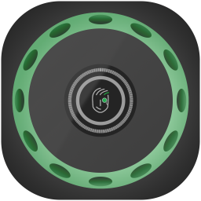
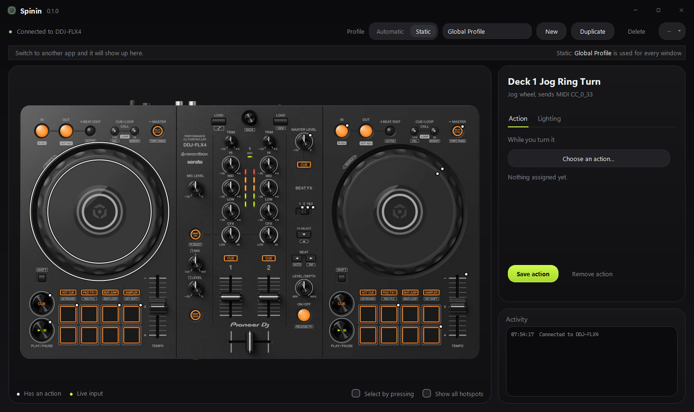
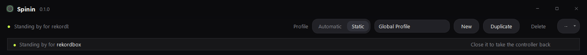
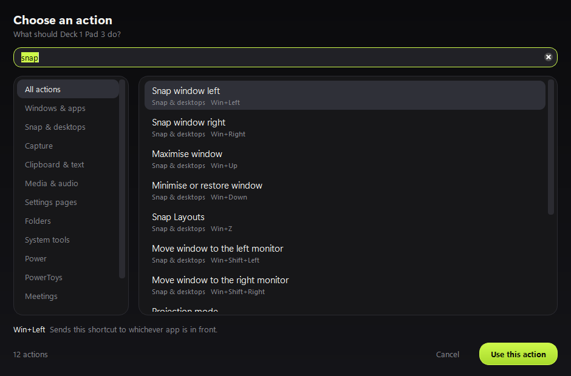
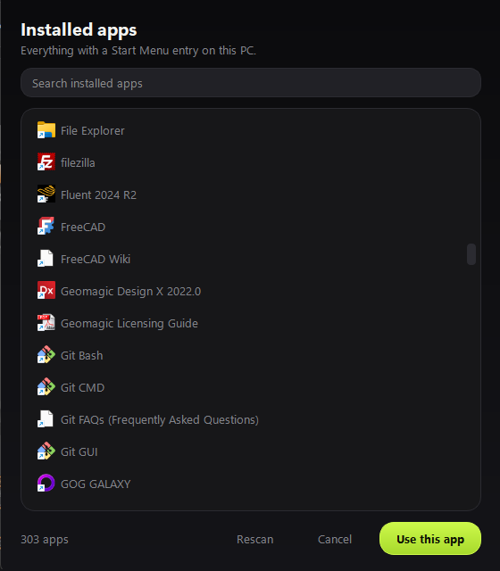
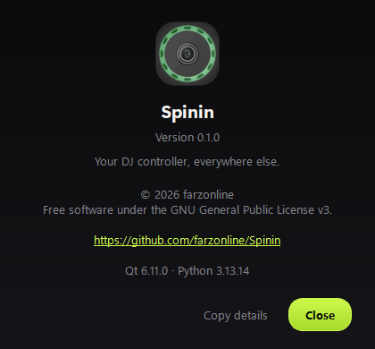

<div align="center">



# Spinin

**Expand the power of your controller.**

Turn a Pioneer DDJ-FLX4 into a control surface for Windows — keyboard shortcuts, system
actions and your own commands, with profiles that follow whichever app is in front.

[](LICENSE)
[](#requirements)
[](https://github.com/farzonline/Spinin/releases)



</div>

---

## What it is

Your DDJ-FLX4 spends most of its life doing nothing. Spinin gives every pad, knob, fader
and jog wheel on it a job outside of DJ software: a shortcut, a system action, an app to
open, a command to run.

Click a control on the picture of the controller, choose what it should do from a library
of **184 actions**, and it works. Nothing to script.

**And it gets out of the way.** Start rekordbox or Serato and Spinin releases the
controller to it, then takes it back when you close it. You never have to think about it.

## What it can do

| | |
|---|---|
| **184 built-in actions** | Windows shortcuts, snap and virtual desktops, screenshots, media keys, PowerToys, meeting mute, accessibility, power, and audio device switching. |
| **Per-app profiles** | Photoshop gets brush sizes, VLC gets seek, your browser gets tabs. Spinin switches automatically with the active window. |
| **All four pad banks** | Hot Cue, Pad FX, Beat Jump and Sampler are four separate sets of mappings per pad — 64 pads' worth on a 16-pad controller. |
| **Jog wheels and encoders** | Scroll, zoom, seek, undo/redo, step frames. With sensitivity, a speed boost that rewards a fast spin, and **smooth scrolling** that coasts after you let go. |
| **Faders and knobs** | System volume, the volume of just the app in front, left/right balance, or scroll by position. |
| **Button lights** | Light while held, toggle, flash, always on or off — per control, per profile. |
| **Stands down for DJ software** | rekordbox, Serato, Traktor, VirtualDJ, djay, Mixxx, Engine DJ and DJUCED take priority automatically. |
| **Six themes** | Including **Voltage**, the default: near black and electric lime. |

## Install

**[Download the latest installer →](https://github.com/farzonline/Spinin/releases/latest)**

Run `Spinin-0.1.0-Setup.exe`. It installs for the current user, so there is no
administrator prompt, and it offers to start with Windows.

<details>
<summary>Or run it from source</summary>

```bash
git clone https://github.com/farzonline/Spinin.git
cd Spinin
py -3.13 -m venv .venv
.venv\Scripts\pip install -r requirements.txt
.venv\Scripts\python main_windows.py
```

</details>

## Getting started

1. Plug the DDJ-FLX4 in over USB. The dot by the app name turns green.
2. Click any control on the picture — or tick **Select by pressing** and press it on the
   hardware.
3. Press **Choose an action…**, search, pick one.
4. **Save action.** That's it.

Controls with a job get a dot on the picture, so you can see what is mapped at a glance.

### Profiles

**Automatic** switches profile to match the window you are in; **Static** pins one.
Anything not set in a profile falls through to Global, so you only override what differs.

When you are in an app with no profile yet, the bar offers **Create profile for
photoshop.exe** — one click.

Profiles import and export as JSON from the **⋯** menu, so they can be shared.

### While you are actually DJing

Nothing to switch off. Open rekordbox and Spinin steps aside:

<div align="center"></div>

Windows hands a MIDI input to one program at a time, so Spinin closes the port outright
rather than just ignoring it — anything less and your DJ software would not see the
controller at all. Close it and Spinin picks the controller back up.

Using DJ software that isn't in the list? Add its process name under `extra_dj_apps` in
`%APPDATA%\Spinin\mappings.json`.

## Screenshots

| Action library | Installed apps | About |
|---|---|---|
|  |  |  |

## Where your settings live

| Running from | Settings file |
|---|---|
| The installer | `%APPDATA%\Spinin\mappings.json` |
| A source checkout | `mappings.json`, beside the source |

Upgrading from a checkout to the installed app? Copy that file into `%APPDATA%\Spinin\`,
or use **⋯ → Export all profiles…** and import them again afterwards.

Uninstalling leaves your settings alone, so reinstalling does not lose your work.

## Requirements

- Windows 10 1809 or later (Windows 11 recommended — the frosted menus are its effect)
- A Pioneer DDJ-FLX4
- To run from source: Python 3.11+

## macOS

[](https://github.com/farzonline/Spinin/actions/workflows/macos.yml)

**Not ready yet.** A macOS port is in the tree: the Quartz and CoreAudio backends, a
138-action Mac catalog, and a CI job that builds a `.app` on every push. On Apple's macOS
runners the whole app builds and runs headless, and sound-device switching works. But
**nobody has used it on a Mac yet**. CI has no keyboard, display or controller, so it can't
show that a keystroke actually reaches another app.

There is no macOS download, and there won't be one until it has been tested on real
hardware. If you have a Mac and a DDJ-FLX4 and want to be the first person to try it, the
checklist and the parts most likely to break are in **[docs/MACOS.md](docs/MACOS.md)**.
Issues and pull requests are welcome.

## Building a release

```bash
.venv\Scripts\pip install -r requirements-dev.txt
.venv\Scripts\pyinstaller --noconfirm Spinin.spec   # -> dist\Spinin\
iscc installer.iss                                  # -> dist\installer\  (needs Inno Setup 6)
```

## Contributing

Issues and pull requests are welcome — especially mappings for apps you use, and DJ
software process names that should be recognised.

Every module runs its own checks. Run one and it tests itself:

```bash
.venv\Scripts\python actions.py
.venv\Scripts\python action_handler.py
.venv\Scripts\python theme.py
```

## Licence

[GNU General Public License v3.0 or later](LICENSE). You may use, study, share and change
it; anything you distribute that is built on it has to stay free under the same terms.

Spinin is not affiliated with or endorsed by AlphaTheta, Pioneer DJ or Serato.
"DDJ-FLX4" and "rekordbox" are the trademarks of their respective owners.
